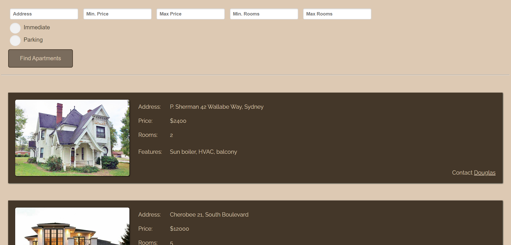

# apartment-seller
This training project simulates search of apartments for rent in a database, using HTML/CSS, Javascript and jQuery and Handlebars libraries 
## What to expect
PLease *do not forget* it is a **training** exercise and a **training** Readme.md as well.
## What you see
...is a web page with the list of apartments and fields for the following filters:
* address (substring in address)
* price (minimum and maximum)
* number of rooms (minimum and maximum)
* two flags:
  * immediate (whether you can contact the lessor directly)
  * parking (whether the apartment has a parking spot). 

That's how the page looks like for the user:

<!-- (https://drive.google.com/file/d/1dcWIhQOWtlXKHfaC61S0XWL3KzU35yW3/preview) -->

